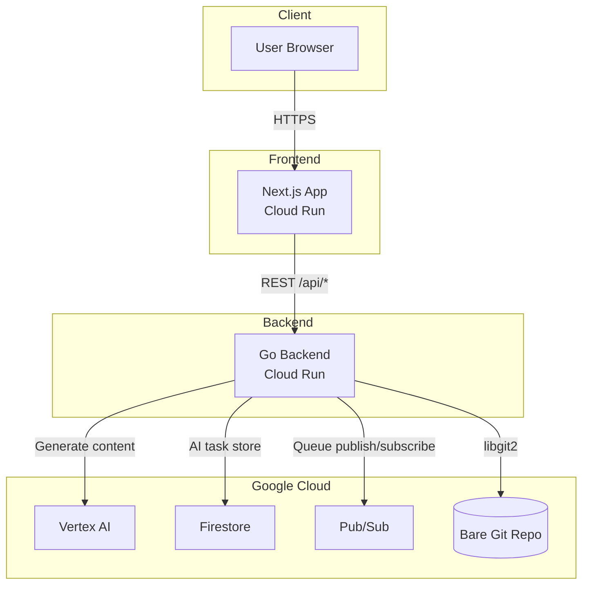

## TL;DR
- 非エンジニアでもアイデアを入力するだけで AI が資料・FAQ・PR を生成し、レビュー→マージまで案内するワークスペースです。
- Vertex AI で生成、Firestore でタスク状態を永続化、Pub/Sub で非同期処理、Cloud Run でフロント/バックエンドをホストしています。
- 3分デモ動画: [YouTube](https://www.youtube.com/watch?v=dQw4w9WgXcQ)

## プロダクト概要
新しいプロダクトをゼロから形にしていくクリエイターが、思いついた瞬間に AI と共創できる――Tsuzura はそんな人たちのためのワークスペースです。アイデアを入力すると Vertex AI が設計書やアーキテクチャ図、ローンチストーリーまで伝えるための素材を一気に編み上げ、提示してくれます。クリエイターは完成像をイメージしながら、AIと対話してアイデアを磨き込むだけでよくなります。

裏側では、生成されたファイルをGitで管理し、Pull Request機能でレビューとマージができます。画面の変更は保存時に自動でPR化されることで変更履歴が透明になり、チームの合意形成も数クリックでできます。手作業でのコピペや導線づくりに時間を奪われることなく、創造性と意思決定に集中できるワークフローを提供します。

## システム構成

## デモ
- プロダクト: _Cloud Run URL_
- デモ動画: _YouTube URL_
- GitHub: [https://github.com/ischca/tsuzura](https://github.com/ischca/tsuzura)

## 使用技術
- Vertex AI Prediction: 生成モデル (text-bison 等)
- Firestore: `agentTasks` コレクションで状態永続化
- Pub/Sub: `agent-tasks` トピックで非同期ワークフロー
- Cloud Run: フロントエンド（Next.js）/バックエンド（Go）
- Terraform: API enable、Pub/Sub、サービスアカウント構築
